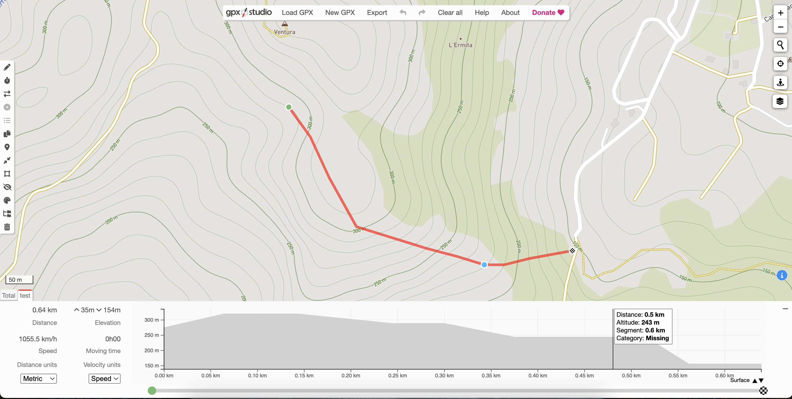

# ptg

Quick script to convert points into GPX files

For elevation estimate uses `https://api.open-elevation.com`.

Coordinates fomat expected:

```text
1: 38.9136472N, 0.2337444W
2: 38.9131778N, 0.2333139W
3: 38.9125250N, 0.2329222W
4: 38.9117389N, 0.2323667W
5: 38.9115889N, 0.2317444W
6: 38.9113889N, 0.2309167W
7: 38.9112639N, 0.2303056W
8: 38.9111306N, 0.2297472W
9: 38.9111306N, 0.2293389W
10: 38.9112306N, 0.2288250W
11: 38.9113139N, 0.2282667W
12: 38.9113556N, 0.2279444W
```

### Usage 

```shell
$ pip install requests
$ python ptg.py -f coordinates.txt -t "Ventura a Collao" -l "Ador" > Ventura-a-Collao.gpx
```

It's possible to view the resulting GPX file using `https://gpx.studio`:


